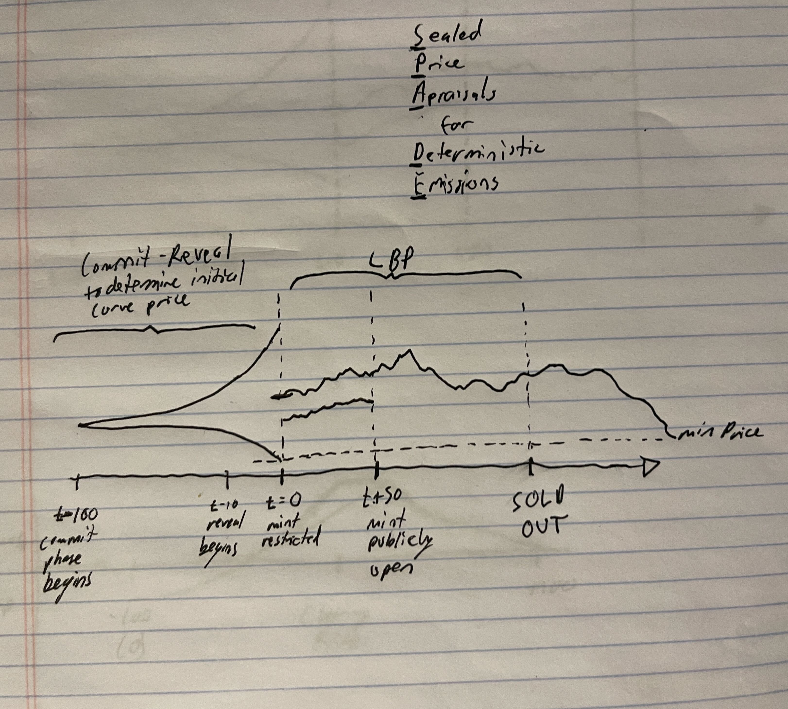
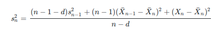
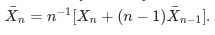

# spades • [](https://github.com/abigger87/spades/actions/workflows/tests.yml) [](https://github.com/abigger87/spades/actions/workflows/lints.yml)  

♠️ **S**ealed **P**rice **A**ppraisals for **D**eterministic **E**missions.

<h4 align="center">

✨✨✨✨✨✨✨✨✨✨✨✨✨✨✨✨✨✨✨✨✨✨✨✨✨✨✨✨✨✨✨✨✨✨✨✨✨✨✨✨✨✨✨✨✨✨✨✨✨✨✨

</h4>

```m
???????????????????????????????????????????????? . ###############################################
???????????????????????????????????????????????  %  ##############################################
??????????????????????????????????????????????  %*:  #############################################
?????????????????????????????????????????????  %#*?:  ############################################
???????????????????????????????????????????  ,%##*??:.  ##########################################
?????????????????????????????????????????  ,%##*?*#*??:.  ########################################
???????????????????????????????????????  ,%###*??*##*???:.  ######################################
?????????????????????????????????????  ,%####*???*###*????:.  ####################################
???????????????????????????????????  ,%####**????*####**????:.  ##################################
?????????????????????????????????  ,%#####**?????*#####**?????:.  ################################
????????????????????????????????  %######**??????*######**??????:  ###############################
???????????????????????????????  %######**???????*#######**??????:  ##############################
??????????????????????????????  %######***???????*#######***??????:  #############################
??????????????????????????????  %######***???????*#######***??????:  #############################
??????????????????????????????  %######***???????*#######***??????:  #############################
???????????????????????????????  %######**??????***######**??????:  ##############################
????????????????????????????????  '%######****:^%*:^%****??????:'  ###############################
??????????????????????????????????   '%####*:'  %*:  '%*????:'   #################################
????????????????????????????????????           %#*?:           ###################################
???????????????????????????????????????????  ,%##*??:.  ##########################################
?????????????????????????????????????????  .%###***???:.  ########################################
????????????????????????????????????????                   #######################################
?????????????????????????????????????????????????*################################################
```


## Overview

Current mints sacrifice both price-discovery and gas efficiency for ordering.

This leads to gas wars and bag shilling, often enabled by gated whitelists.

[Spades](https://github.com/abigger87/spades) is an attempt to maximize the ERC721 drop tradeoff by building off of [Cloaks](https://github.com/abigger87/cloaks).

TL;DR - [Spades](https://github.com/abigger87/spades) is an ERC721 with a builtin commit-reveal scheme to determine the initial clearing price of an LBP.

## How it works

Spades is an ERC721 Token with built-in minting broken down into four phases.

#### Phase 1 - Commitments

Spades begins with a commit phase that lasts from `commitStart` to `revealStart`.

During the commit phase, anyone can permissionlessly call the `commit(bytes32)` function, passing in a hashed commitment (32 bytes).

The hashed commitment includes an appraisal price (at which each ERC721 token should be valued) along with a `blindingFactor` that prevents hash table attacks.

Calling the commitment also requires a `depositAmount` of ether or the `depositToken` to prevent commitment spam.

#### Phase 2 - Reveals

At this point, there are a bunch of commitments stored in the Spades Contract.

Once the Reveal Phase begins when the `block.timestamp` reaches `revealStart`, participants from phase 1 can reveal their appraisal by calling the `reveal(uint256,bytes32)` function.

Where the first argument is the appraisal value and the second is the `blindingFactor`.

Once this function is called, the sender's sealed appraisal becomes public.

⚠️ NOTE ⚠️ If a commit phase participant fails to reveal their commitment, they will incur the Spade's `MAX_LOSS_PENALTY` (in bips) on their deposit. After the reveal phase, the user may call `lostReveal()` to extract the remainder of their deposit.

#### Phase 3 - Restricted Mint

When the timestamp reaches `restrictedMintStart`, the reveal phase ends and the Restricted mint period begins.

Since all appraisals have been revealed, a `clearingPrice` can be calculated as the mean of all committed appraisals.

This is the starting mint price.

Participants who revealed their appraisals can now call `restrictedMint()` to mint one ERC721 token at a **discounted** price.

Calling `restrictedMint()` requires the discounted price to be sent in ether or will be transferred from the user for the specified `depositToken`.

Where the discount is proportional to how close their appraisal value was to the calculated `clearingPrice`.

⚠️ NOTE ⚠️ Outliers (normally a zscore of 3, but for tighter bounds Spades uses a zscore of 2) cannot mint.

Also note, the max discount factor is 2,000 bips or 20% off the `clearingPrice`.

To view their discount price, a particpant can call the `restrictedMintPrice()` function.

To check restricted minting eligibility, a participany can call the `canRestrictedMint()` function.

Additionally, a user can choose to `forgo()` their mint allocation (outliers must do this to recover part of their deposit).

The `forgo()` function will return the `depositAmount` less a loss penalty inversely related to how close their appraisal was to the `clearingPrice`.

⚠️ NOTE ⚠️ Outliers will lose the `MAX_LOSS_PENALTY`.

#### Phase 4 - Public LBP

At this point, if not all ERC721 tokens are minted (`tokenSupply < MAX_TOKEN_SUPPLY`), minting is enabled for everyone, including non-commitment participants.

When `block.timestamp` is greater than or equal to `publicMintStart`, the `mint(uint256)` function can be called, supplying the number of tokens to be minted.

The public `mint` function requires ether to be sent or the `depositToken` will be transferred at an initial amount equal to the `clearingPrice` (or the `minPrice` if `clearingPrice < minPrice`).

**With one important caveat** - the price to mint is modeled after an LBP.

That is, on each new token minted, the price to mint another token increase by `priceIncreasePerMint` and on each new block, the price decreases by `priceDecayPerBlock`.

⚠️ NOTE ⚠️ no more than `MAX_MINT_PER_ACCOUNT` can be minted per account (except for the commitment participants who can mint `MAX_MINT_PER_ACCOUNT + 1`).


## Motivation

Essentially the same as [cloaks](https://github.com/abigger87/cloaks).

Mints suck...

They're difficult to mint, oft impossible.

The mint price is fixed - artists and creators don't realize upside.

Whitelists, gating methods, and gas wars prevent any semblance of a fair mint.

## Extremely Technical Docs

#### Phases



#### Rolling Variance Calculation



#### Rolling Mean Calculation



## Blueprint

```ml
lib
├─ ds-test — https://github.com/dapphub/ds-test
├─ forge-std — https://github.com/brockelmore/forge-std
├─ solmate — https://github.com/Rari-Capital/solmate
├─ clones-with-immutable-args — https://github.com/wighawag/clones-with-immutable-args
src
├─ tests
│  └─ Spade.t — "Spade Tests"
└─ Spade — "Spade ERC721 Contract"
```

## Development

A [Spade](https://github.com/abigger87/spades) is an extensible ERC721 implementation with a commit-reveal scheme and lbp built _into_ the ERC721 contract itself.
The only contract is located in [src/](./src/) called [Spade](./src/Spade.sol).

It is an abstract contract and requires an implementation for `tokenURI` as in [MockSpade](./src/test/mocks/MockSpade.sol);

Both [DappTools](https://dapp.tools/) and [Foundry](https://github.com/gaskonst/foundry) are supported. Installation instructions for both are included below.

#### Install DappTools

Install DappTools using their [installation guide](https://github.com/dapphub/dapptools#installation).

#### First time with Forge/Foundry?

See the official Foundry installation [instructions](https://github.com/gakonst/foundry/blob/master/README.md#installation).

Don't have [rust](https://www.rust-lang.org/tools/install) installed?
Run
```bash
curl --proto '=https' --tlsv1.2 -sSf https://sh.rustup.rs | sh
```

Then, install the [foundry](https://github.com/gakonst/foundry) toolchain installer (`foundryup`) with:
```bash
curl -L https://foundry.paradigm.xyz | bash
```

Now that you've installed the `foundryup` binary,
anytime you need to get the latest `forge` or `cast` binaries,
you can run `foundryup`.

So, simply execute:
```bash
foundryup
```

🎉 Foundry is installed! 🎉

#### Setup

```bash
make
# OR #
make setup
```

#### Build

```bash
make build
```

#### Run Tests

```bash
make test
```

#### Configure Foundry

Using [foundry.toml](./foundry.toml), Foundry is easily configurable.

## License

[AGPL-3.0-only](https://github.com/abigger87/spades/blob/master/LICENSE)

# Acknowledgements

- [Glass.xyz's LBP ERC721](https://github.com/GlassProtocol/LBPERC721/blob/main/src/LBPERC721.sol)
- [commit-reveal schemes](https://medium.com/swlh/exploring-commit-reveal-schemes-on-ethereum-c4ff5a777db8)
- [foundry](https://github.com/gakonst/foundry)
- [solmate](https://github.com/Rari-Capital/solmate)
- [forge-std](https://github.com/brockelmore/forge-std)
- [clones-with-immutable-args](https://github.com/wighawag/clones-with-immutable-args).
- [Brock Elmore](https://github.com/brockelmore) for [forge-std](https://github.com/brockelmore/forge-std)
- [foundry-toolchain](https://github.com/onbjerg/foundry-toolchain) by [onbjerg](https://github.com/onbjerg).
- [forge-template](https://github.com/FrankieIsLost/forge-template) by [FrankieIsLost](https://github.com/FrankieIsLost).
- [Georgios Konstantopoulos](https://github.com/gakonst) for [forge-template](https://github.com/gakonst/forge-template) resource.

## Disclaimer

_These smart contracts are being provided as is. No guarantee, representation or warranty is being made, express or implied, as to the safety or correctness of the user interface or the smart contracts. They have not been audited and as such there can be no assurance they will work as intended, and users may experience delays, failures, errors, omissions, loss of transmitted information or loss of funds. The creators are not liable for any of the foregoing. Users should proceed with caution and use at their own risk._
